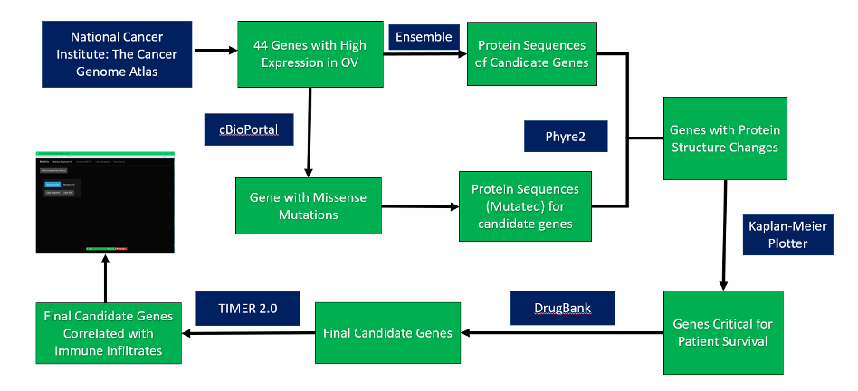

# MiSeVis
## Overview
**Ovarian cancer** detection remains elusive due to a lack of screening tests and non-specific symptoms. A crucial factor in cancer development is **DNA sequence mutations**, particularly missense mutations that can alter protein structure, thereby potentially initiating carcinogenesis. Advances in sequencing technology have paved the way for detailed analysis of individual genetic profiles, spotlighting genes with missense mutations as prospective biomarkers. Such biomarkers are pivotal for personalizing cancer therapies, as they can guide medication choices, ensuring efficacy and minimizing detrimental effects. 

Here, we developed a convenient platform **MiSeVis** that allow users to 
* **Retrieve Sequence File**
* **Visualize PDB File**
* **Check DrugBank**
* **Survival analysis**
**Animated workflow:**

## Workflow

## Citation
Please check our paper "Computational Identification of Ovarian Cancer Candidate Driver Genes with Mutated Protein Structures Caused by Missense Variants" for more details.
